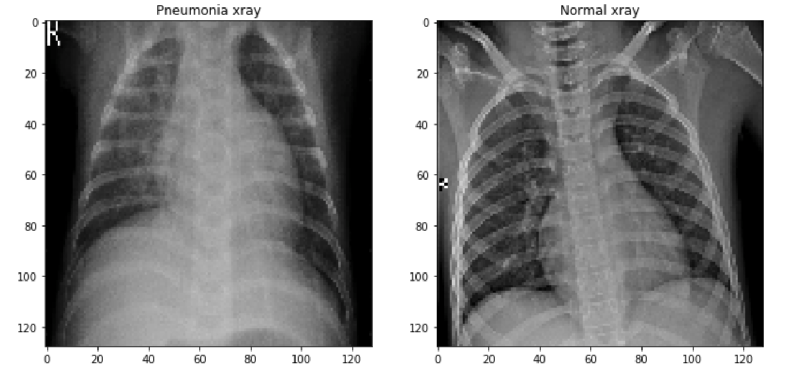
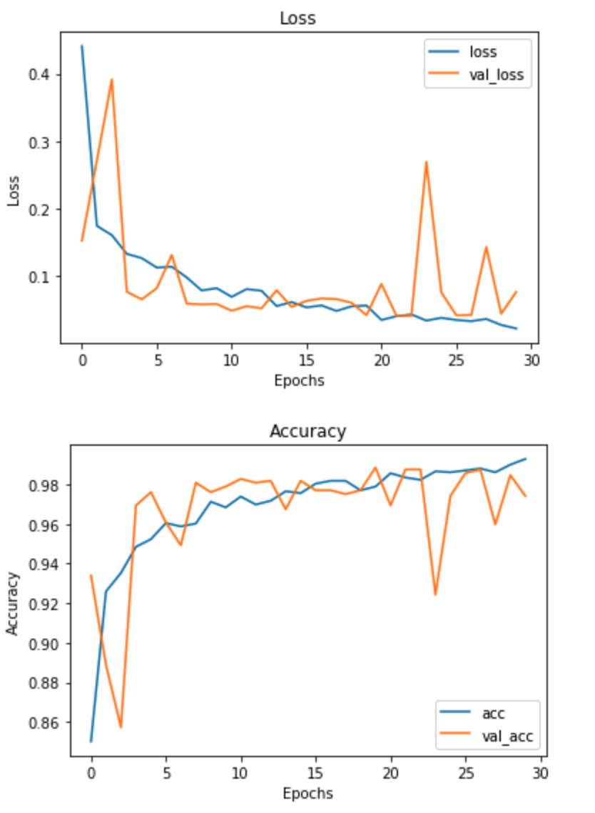
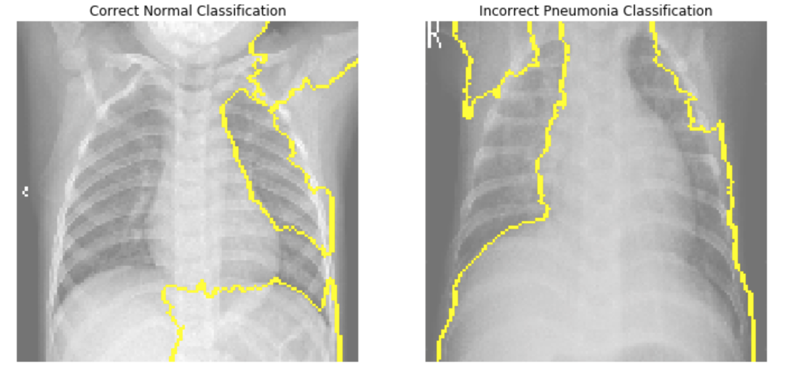

# Pneumonia X-ray classification

## Task

To build a convolution neural network model that can classify whether a given patient has pneumonia or not by looking at different X-ray images of patients lungs.

## Data

The data that was used for this project is from a kaggle dataset of Pneumonia X-rays via [link](https://www.kaggle.com/paultimothymooney/chest-xray-pneumonia).  This dataset included 5856 unique images of chest x-rays depicting normal or pneumonia x-rays.




## Models

The best performing model is a multi layered keras sequential model test accuracy of 84%.  Using relu activation function, a binary cross-entropy loss function and  9 convolutional layers, 5 maxpooling layers and 3 fully connected layers.



## Feature importances

Using the Lime package I was able to predict the features in the images that models found most important in making its predictions.  The image on the left was correctly classified as someone who doesn't have pneumonia.  The image on the right was incorrectly classified as someone who doesn't have pneumonia but this image of an x-ray is from some one who actually has pneumonia.



## Conclusion

### Recommedations

To save the X-rays images with a higher pixel count so that the images will be more clear for the models to best accurately make correct predictions.

Find more X-rays of people that don't have pneumonia to help balance out the imbalances between the images with pneumonia vs. non-pneumonia.


## Future work - with more time

I would like to continue tuning the models by freezing and unfreezing specific layers of the transfer learning models to fine tune them.

Try out a schedule learning rate decay

Try out more epochs and batch sizes


```python

```
